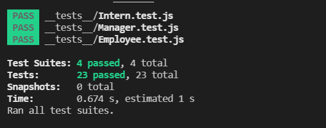
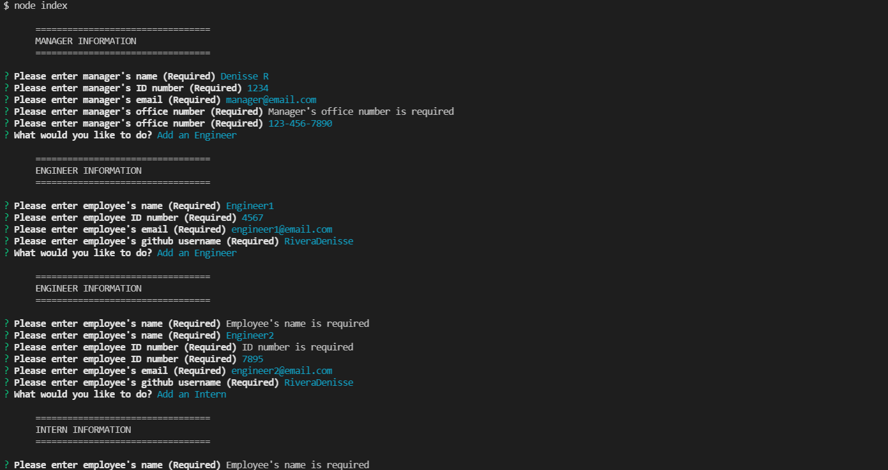

# Team-Profile-Generator
  
  ## Description

  This application allows a user to generate an HTML page with a visual representation of their team. The manager has an office number listed, engineers have links to their GitHub profiles, and interns have their school listed. All three have a linked email address on their contact card.

 
  ## Table of Contents

  * [Installation](#installation)
  * [Usage](#usage)
  * [Photos](#photos)
  * [Credits](#credits)
  * [License](#license)
  * [Video](#video)
  * [Questions](#questions)
  
  
  ## Installation

  * Clone the repository 
  * In the directory where you have the project saved, make sure you have the required dependencies installed (npm init,npm install inquirer, npm install jest(in order to run the tests))

  ## Usage

  * From the command line in the directory with this project, type node index to run the program 
  * Enter the manager information 
  * select if you would like to add an Engineer, Add an Intern or Finalize the team *If you select "Add an Engineer" or "Add an Intern" then provide the information accordingly 
  * When finished, the program will give a message that the HTML file was created

  ## Photos

  ## Credits

  JavaScript,Node.js,BootStrap were utilized

  ## License
  This application is covered by MIT License. For more information about the license please click [here](https://choosealicense.com/licenses/mit/)

 ## Video

  A walkthrough video of the application is available [here](https://drive.google.com/file/d/1sFPloEyJ7PeaaG5zm5dyNAU90s6u_2-5/view)
  
  ## Questions

  For any questions, please contact me using the information below:

  * Github Profile: [RiveraDenisse](https://github.com/RiveraDenisse)
